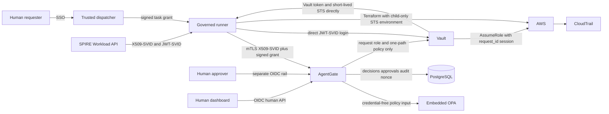
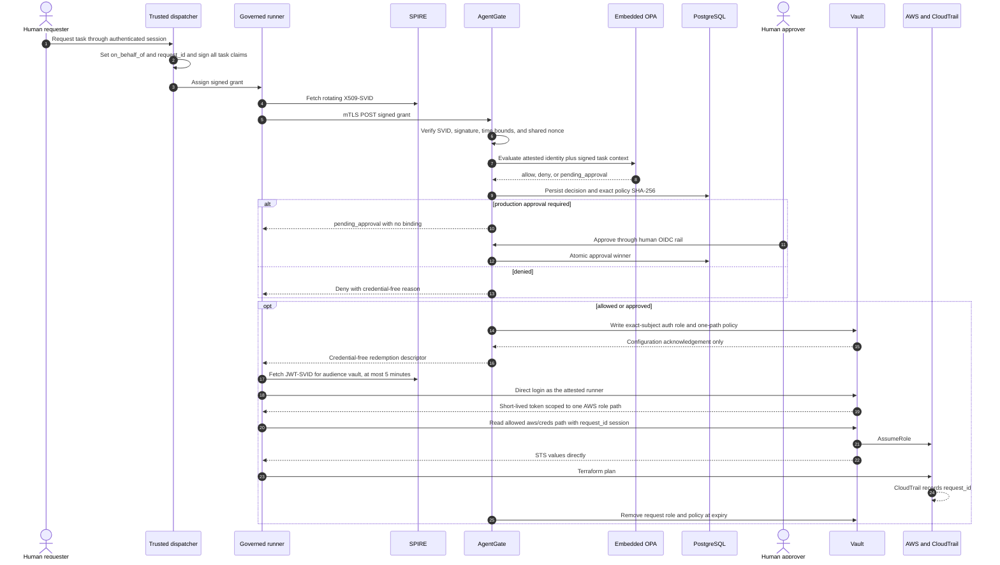

# AgentGate

**Secure infrastructure access for AI agents.** AgentGate is a SPIFFE-native,
credential-blind access broker: it lets an AI agent running inside an attested
workload obtain narrow, short-lived cloud access for one signed task, without
ever holding a permanent credential, and without the broker ever touching a
secret. It is for platform engineers, security teams, and anyone designing
governed runners in attestable infrastructure.

<p align="center">
  
</p>

**The problem.** Companies are letting AI agents modify Terraform, operate
pipelines, inspect clusters, and create cloud resources, usually by
inheriting human credentials, broad service accounts, or long-lived API keys.
**The boundary AgentGate enforces:** SPIFFE/SPIRE proves *what is running*;
a dispatcher-signed grant proves *what it was asked to do*; AgentGate
authorizes the pair against default-deny policy with human approval gates;
Vault issues the short-lived credential *directly to the workload*; the
target platform's IAM enforces the blast radius; one `request_id` joins every
record from the human's request to CloudTrail.

An allowed request always needs two independent proofs: a SPIRE-attested
workload identity and dispatcher-signed task context. AgentGate evaluates and
configures access, but the governed runner authenticates directly to Vault and
passes issued AWS STS values only to its Terraform child process.

> **Reference status:** Go, policy, dashboard, PostgreSQL, deployment, and real
> Vault integration checks are automated. The three Terraform roots have not
> been applied to an AWS account in this repository's verification environment.
> See [known gaps](docs/KNOWN-GAPS.md) before presenting the sandbox as an
> end-to-end cloud demonstration.

## The model at a glance

| Property | Contract |
| --- | --- |
| Proof 1: workload | An X509-SVID proves the attested namespace, service account, and workload identity. |
| Proof 2: task | A trusted dispatcher signs repository, commit, operation, environment, role, TTL, human attribution, ticket, nonce, and `request_id`. |
| Human accountability | `on_behalf_of` comes from the dispatcher's authenticated human session; production apply uses a separate human approval rail. |
| Control plane | AgentGate verifies proofs, evaluates embedded OPA, persists credential-free state, and writes/deletes request-scoped Vault roles and policies. |
| Credential data plane | The runner obtains its own JWT-SVID, logs in directly to Vault, receives STS directly, and gives STS only to Terraform. |
| Primary control | TTL defaults and clamps to 15 minutes. Revocation prevents new access where possible but does not reliably invalidate issued AWS STS values. |
| Governance modes | Autonomous runners in attestable infrastructure are in scope. Interactive IDE agents using human IAM on employee laptops are not. |

AgentGate governs access, not intent. A prompt-injected agent can still cause
damage inside legitimately granted scope.

## Scope: two identity rails, not one

| Mode | Identity | Environment | AgentGate |
| --- | --- | --- | --- |
| Interactive human-driven assistant | Human SSO/IAM | Employee workstation | Out of scope; use existing human IAM and endpoint controls |
| Autonomous governed runner | SPIFFE workload identity plus signed task grant | Selected Kubernetes workload | In scope; policy, approval, Vault binding, TTL, and audit apply |

A human OIDC token cannot satisfy the workload route. A workload SVID cannot
approve, deny, list, or revoke requests. A signed grant does not turn an
employee laptop into an attested runner.

## Access profiles

Every allowed request binds one Vault role and one read-only
`<mount>/creds/<role>` path. Which mount serves an operation is an **access
profile**, the extension point that turns one broker into many lanes:

| Operation | Vault engine | Status |
| --- | --- | --- |
| `terraform-plan` / `terraform-apply` | AWS STS (`aws/creds/*`) | End to end: policy, binding, direct redemption, reference Terraform runner, sandbox deployment |
| `kubernetes-inspect` | Kubernetes secrets mount (`kubernetes/creds/*`) | Control plane complete and tested against real Vault (policy, per-request role, cross-profile isolation, revocation); sandbox engine wiring and a reference runner are future work |

The real-Vault integration test proves cross-profile isolation: a
kubernetes-lane token cannot read the AWS credential path, and vice versa.
Adding a lane (databases, SSH, internal APIs) is one profile entry plus
policy; the credential-blind contract does not change.

## Architecture



The AgentGate-to-Vault arrow is control-plane configuration. AgentGate's own
SPIFFE-derived Vault authorization cannot read `aws/creds/*`. The
runner-to-Vault and runner-to-AWS arrows are the credential data plane; no Vault
workload token, lease identifier, or AWS value crosses AgentGate's API, process,
database, logs, webhook, or dashboard.

## Request sequence



One `request_id` is preserved across the signed grant, decision, policy version,
approval, Vault role/policy and audit metadata, AWS role session, and CloudTrail
lookup.

## Expected outcomes

| Scenario | Expected result |
| --- | --- |
| Valid signed sandbox plan from the matching runner | `allow`, `not_required`, request binding `enabled`, direct Vault redemption, successful Terraform plan |
| Policy denial | Credential-free denial reason; no Vault binding |
| Production Terraform apply | `pending_approval`; no binding until one separately authenticated human transition wins |
| Human denial | `denied`, binding `not_required`, no descriptor |
| Matching JWT-SVID | Vault login succeeds only for the exact subject/audience and one permitted path |
| Wrong workload or audience | AgentGate or Vault rejects it even if the signed grant is visible |
| Tampered or replayed grant | Rejected before policy/Vault; invalid signatures do not burn a valid nonce |
| Revoke or TTL expiry | New login is prevented where possible; issued STS may remain valid until its bounded expiry |
| Correlation | Final runner output and operational records carry the same `request_id`; no credential field is returned |

The embedded demo plans one S3 marker object under the governed prefix. It never
applies the plan.

## Local quickstart

### Prerequisites

- Go 1.24;
- OPA;
- golangci-lint 2.12.2;
- Docker for the required real-Vault test;
- Node.js 22.12 or newer and npm for the dashboard;
- Terraform 1.15.6, Helm, and ShellCheck for deployment checks.

Run the backend, race, lint, and policy suite:

```bash
AGENTGATE_REQUIRE_DOCKER=true make check
```

Colima users may need:

```bash
export DOCKER_HOST="unix://${HOME}/.colima/default/docker.sock"
export TESTCONTAINERS_DOCKER_SOCKET_OVERRIDE='/var/run/docker.sock'
```

Run the dashboard suite:

```bash
cd dashboard
npm ci
npm run typecheck
npm run lint
npm test
npm run build
```

Run deployment static checks without contacting AWS:

```bash
terraform fmt -check -recursive deploy
for root in bootstrap infra platform agentgate; do
  terraform -chdir="deploy/${root}" init \
    -backend=false \
    -input=false \
    -lockfile=readonly
  terraform -chdir="deploy/${root}" validate
done
render_dir="$(mktemp -d)"
deploy/scripts/render-charts.sh "${render_dir}"
deploy/scripts/assert-agentgate-static.sh
terraform -chdir=deploy/bootstrap test
terraform -chdir=deploy/agentgate test
shellcheck deploy/scripts/*.sh deploy/scripts/lib/*.sh
rm -rf "${render_dir}"
```

Generate a disposable local dispatcher key pair and inspect a signed,
credential-free grant:

```bash
go run ./cmd/agentgate grant-keygen
go run ./cmd/orchestrator-stub \
  --repo='github.com/example/governed-infra' \
  --commit-sha='0123456789abcdef0123456789abcdef01234567' \
  --vault-role='terraform-sandbox' \
  --on-behalf-of='student@example.test' \
  --ticket-id='LAB-1'
```

Generated PEM files are ignored by Git. They are PoC trust material, not
production dispatcher identity.

Running `agentgate serve` requires PostgreSQL migrations, TLS/SPIFFE roots, a
dispatcher public key, a SPIFFE Workload API, Vault, a webhook endpoint, and
either human OIDC or explicitly gated PoC auth. Startup validates every
dependency and fails without printing secret values. A prebuilt dashboard can
optionally be served with `--dashboard-dir`; API authentication remains
unchanged.

## AWS sandbox quickstart

Use a dedicated account and read the full [deployment guide](docs/DEPLOY.md);
the guide deliberately exposes cost and manual security boundaries rather than
hiding them in a one-command script.

1. Complete [prerequisites](docs/DEPLOY.md#prerequisites), including an
   existing S3 state bucket, and apply `deploy/bootstrap` (GitHub OIDC
   deployment trust). Do not create static AWS keys.
2. Run [static validation](docs/DEPLOY.md#static-validation-before-any-plan).
3. Apply [infrastructure](docs/DEPLOY.md#apply-layer-1-infrastructure).
4. Apply and initialize the [platform](docs/DEPLOY.md#apply-layer-2-platform-first-pass),
   then apply its Vault configuration pass.
5. Build by immutable digest and [apply layer 3](docs/DEPLOY.md#build-and-apply-layer-3).
6. Run the [direct redemption demo](docs/DEPLOY.md#end-to-end-direct-redemption)
   and correlate Vault/CloudTrail without printing credentials.
7. Run the complete [90-minute lab](docs/TEACHING.md) when teaching.
8. [Destroy in reverse order](docs/DEPLOY.md#reverse-destroy) when idle.

The sandbox uses AWS SSO locally, GitHub Actions OIDC in CI, and runtime
Kubernetes Secret references. No AWS key or Vault token belongs in Terraform
variables, state, or GitHub. See
[ADR-0001](docs/adr/0001-deployment-control-plane.md) for the deployment
decision record.

## Repository layout

| Path | Responsibility |
| --- | --- |
| `cmd/agentgate` | `serve`, human `revoke`, and dispatcher key generation |
| `cmd/orchestrator-stub` | PoC signed-task dispatcher with `--tamper` failure mode |
| `cmd/agent-sim` | X509-SVID request, approval polling, direct Vault redemption, and Terraform child |
| `internal/api` | Chi routes and isolated workload/human authentication rails |
| `internal/grant` | Canonical Ed25519 grant verification and shared replay protection |
| `internal/svid` | X.509-SVID chain, SAN, and trust-domain validation |
| `internal/authz` | Canonical request, decision, descriptor, and policy contracts |
| `internal/vaultmgr` | Credential-blind Vault role/policy management |
| `internal/approval` | Durable approval and binding state machines |
| `internal/expiry` | Multi-replica request-binding expiry reconciliation |
| `internal/audit` | Immutable credential-free audit records and forward migrations |
| `policies` | Embedded default-deny Rego and tests |
| `dashboard` | OIDC React operations UI |
| `deploy/bootstrap` | GitHub OIDC deployment trust for CI applies |
| `deploy/infra` | VPC, EKS, demo IAM target, and tagged S3 target |
| `deploy/platform` | SPIRE, Vault, PostgreSQL, and Vault/AWS configuration |
| `deploy/agentgate` | AgentGate, identity registrations, and suspended demo Jobs |
| `docs` | Architecture, deployment, gap register, and teaching lab |

## Development and CI

The merge-bar commands are:

```bash
test -z "$(gofmt -l $(find . -type f -name '*.go' -not -path './vendor/*'))"
go build ./...
go vet ./...
AGENTGATE_REQUIRE_DOCKER=true go test -race ./...
golangci-lint run ./...
opa fmt --diff policies
opa check policies
opa test -v policies
```

When `AGENTGATE_TEST_DATABASE_URL` is unset, the PostgreSQL integration
tests start a disposable pinned `postgres:17` container through Docker; with
`AGENTGATE_REQUIRE_DOCKER=true` they fail instead of skipping when Docker is
unavailable. Point the variable at an existing database to skip the
container.

Then run the dashboard and deployment checks from the local quickstart. CI also:

- exercises PostgreSQL migrations up and down;
- runs real PostgreSQL integration and multi-replica transition tests;
- starts pinned Vault 2.0.3 and proves direct JWT login, exact one-path access,
  agent audit attribution, expiry cleanup, and post-revoke login failure;
- scans deployment files for static cloud credential patterns.

## Reference documentation

- [Usage and implementation guide](docs/USAGE.md)
- [Architecture and invariants](docs/ARCHITECTURE.md)
- [AWS/EKS deployment and manual verification](docs/DEPLOY.md)
- [Ranked known gaps](docs/KNOWN-GAPS.md)
- [Complete 90-minute teaching lab](docs/TEACHING.md)
- [Dashboard development](dashboard/README.md)

## PoC limitations

- **Issued STS survives hygiene operations.** Deleting a request role/policy or
  revoking a Vault token does not reliably invalidate AWS STS already issued.
- **Access is not intent.** Policy proves that identity and signed scope satisfy
  rules; it does not prove the Terraform change is desirable.
- **Task completion is unsolved.** A workload callback cannot reliably prove all
  subprocesses and credential copies are gone, so TTL remains primary.
- **The dispatcher is trusted.** A compromised signer can invent task context
  still permitted by policy.
- **Platform services are sandbox-shaped.** Production needs HA, automated
  unseal, backups, database TLS, monitored reconciliation, hardened nodes and
  egress, and tested recovery.
- **PoC human auth is not production SSO.** Static bearer mode is explicit and
  isolated; production uses OIDC.
- **Normal CI has no AWS.** EKS, IAM behavior, target tags, Vault's real AWS
  engine, STS, and CloudTrail are manual sandbox checks.

See [KNOWN-GAPS.md](docs/KNOWN-GAPS.md) for owners, evidence, workarounds, and
closure criteria.

## Cost and teardown

EKS control-plane hours, two worker nodes, a NAT gateway, public IPv4, EBS,
CloudWatch, data transfer, and the state-bucket KMS key can incur charges.
Review the plan and current pricing before apply.

**Destroy the sandbox when idle.** Destroy `agentgate`, then `platform`, then
`infra`, then `bootstrap`, and verify EKS, EBS, NAT, S3, IAM, and logs are
gone as described in [Reverse destroy](docs/DEPLOY.md#reverse-destroy).
