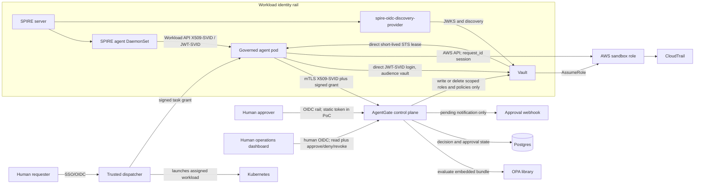
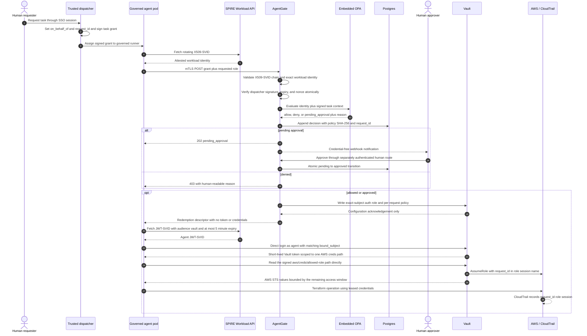
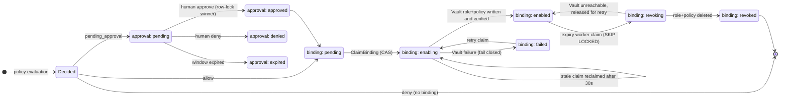
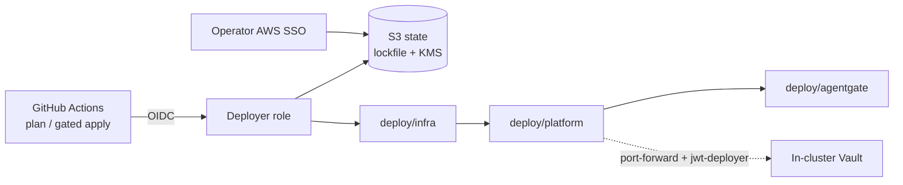

# AgentGate architecture

## Status and scope

AgentGate is an open-source control plane for governing autonomous AI agents
that need temporary access to cloud infrastructure. This repository is a
production-shaped sandbox reference and teaching system. It is not a claim that
an AI agent is safe, aligned, or free from prompt injection.

The integrated reference implements the trust boundaries, signed task grants,
X.509-SVID validation, policy, Vault manager, API, approval workflow,
deployment, dashboard, direct redemption path, and stable Go interfaces. AWS
sandbox verification remains explicitly manual.

## Non-negotiable invariants

1. **Control plane and data plane are separate.** AgentGate decides whether a
   binding may exist and configures that binding. It never reads, proxies,
   stores, logs, or returns a Vault lease, Vault workload token, AWS access key,
   AWS secret key, AWS session token, or other target credential.
2. **Vault attributes leases to the agent.** The agent authenticates directly to
   Vault with its own SPIFFE identity. AgentGate never authenticates to Vault on
   an agent's behalf. Vault audit entries therefore name the agent workload.
3. **Every access request needs two independent proofs.** An attested SVID proves
   what workload is running and where. A dispatcher-signed task grant proves
   that the workload was assigned this task. Neither proof alone authorizes
   access, and the agent cannot mint its own task context.
4. **A human remains accountable.** `on_behalf_of` comes from the dispatcher's
   SSO session, not from the agent. One `request_id` links human request, signed
   grant, versioned policy decision, approval, Vault role, Vault lease, AWS STS
   role session, and CloudTrail activity.
5. **Human and workload identities use separate rails.** Humans authenticate by
   SSO/OIDC. Autonomous workloads authenticate by SPIFFE. No middleware treats
   one as the other.
6. **TTL is the primary control.** The default grant and credential lifetime is
   15 minutes. Deleting bindings and revoking leases are useful hygiene, but an
   issued AWS STS credential generally remains valid until it expires.
7. **Unattested environments cannot receive privileged credentials.** Vault JWT
   auth roles use `bound_subject` set to one exact SPIFFE ID. A developer laptop
   cannot satisfy the governed runner's subject even if it obtains a valid task
   grant.

Any implementation that violates an invariant is architecturally incorrect,
even if its tests pass.

## System context

The line from AgentGate to Vault is control-plane configuration. AgentGate's
own short-lived Vault authorization is minted from AgentGate's own SPIFFE
identity and is limited to writing and deleting JWT auth roles and policies
under an AgentGate-owned prefix. It cannot read the AWS secrets engine or any
secret path, and it is never persisted or logged.

The lines from the runner to Vault and AWS are the credential data plane.
Credential material never crosses an AgentGate process, API, database, webhook,
or dashboard.

## Request sequence

AgentGate's successful response is a `RedemptionDescriptor`: Vault address,
auth mount, request-scoped auth role, one secrets path, required audience, and
expiry. The type has no token, lease, or credential fields. Adding such a field
is prohibited.

An AgentGate lifecycle worker claims request bindings in PostgreSQL before the
descriptor expires and removes the role and policy. Claims use
`FOR UPDATE SKIP LOCKED` across replicas and stale-claim recovery after a
restart. The descriptor and reference agent independently reject an expired
window.

## Request lifecycle state machine

Approval and binding state live in PostgreSQL; every transition below is a
serializable row-locked update, and only the single winning approval
transition can reach `EnableAccess`.

## Two independent proofs

### Proof 1: workload identity

SPIRE attests Kubernetes workloads using selectors that include namespace and
service account. The SPIRE agent DaemonSet exposes the Workload API socket only
to eligible pods. The workload receives a short-lived X509-SVID for mTLS to
AgentGate and can request a short-lived JWT-SVID for a specific audience.

AgentGate validates the mTLS client chain against configured SPIFFE roots,
requires one SPIFFE URI SAN and no competing SAN identity, enforces a trust
domain allowlist, and derives `spiffe_id` from the certificate. It does not trust
a request-body identity field.

Vault trusts SPIRE's OIDC discovery endpoint. Every request-specific Vault auth
role has `bound_subject` equal to the exact governed runner SPIFFE ID and
`bound_audiences` equal to `vault`. The JWT-SVID expiry is at most five minutes.

### Proof 2: task context

The dispatcher is the company's internal AI portal or CI system. In the PoC it
uses Ed25519 to sign a `TaskGrant` containing:

- `request_id`
- `repo`
- `commit_sha`
- `operation` (`terraform-plan`, `terraform-apply`, or `kubernetes-inspect`)
- `environment`
- `vault_role`
- `ttl` in seconds
- single-use `nonce`
- `issued_at`
- `on_behalf_of`
- `ticket_id`
- `signature`

`on_behalf_of` is copied from the dispatcher's authenticated SSO context. It is
never accepted from an agent-authored field. The signature covers every claim
except `signature`. Verification checks the signature and time bounds before it
atomically consumes the nonce in shared storage. This ordering prevents invalid
traffic from burning valid nonces while still preventing replay across replicas.

Production should replace the Ed25519 stub with the organization's existing
dispatcher identity, typically verified OIDC claims such as GitHub Actions
OIDC. The resulting claims must preserve the same semantics, especially human
attribution and task assignment.

## Governance modes

| Mode | Identity used for cloud access | Environment | AgentGate jurisdiction |
| --- | --- | --- | --- |
| Interactive human-driven agent, such as an IDE assistant | Human IAM/SSO identity | Employee workstation or interactive environment | Out of scope; govern through existing human IAM, SSO, and endpoint controls |
| Autonomous delegated agent | SPIFFE workload identity plus dispatcher task grant | Attestable governed runner pod | In scope; AgentGate policy, approval, Vault binding, TTL, and audit apply |

These modes are deliberately not merged. A human OIDC token cannot substitute
for a workload SVID, and a workload SVID cannot authenticate an approver or
dashboard user. An IDE agent running on an employee laptop is not converted into
a governed runner by attaching a signed grant.

## Control plane and credential data plane

AgentGate performs only these Vault operations:

- create or delete a request-scoped JWT auth role;
- bind that role to one exact SPIFFE subject and the `vault` audience;
- create or delete a request-scoped policy that grants only `read` on one
  `<mount>/creds/<role>` path, where the mount is selected by the operation's
  configured access profile (AWS STS for the terraform operations; a Vault
  Kubernetes secrets mount for `kubernetes-inspect`);
- report that exact lease cleanup was not performed when no credential-free
  lease identifier exists.

AgentGate cannot call the AWS credentials read path. Its Vault management policy
must contain no `read` capability on secrets engines. The agent performs its own
Vault login and credentials read. Vault then performs `AssumeRole`, returns STS
credentials directly to the agent, and records the agent subject in its audit
device.

This separation provides both containment and attribution. A generic broker that
logged into Vault for every agent would make Vault's audit log identify the
broker, destroying the chain this design is intended to preserve.

## Human accountability and correlation

The same `request_id` must be carried through:

1. the human's dispatcher request;
2. the signed task grant;
3. the AgentGate access request and immutable audit events;
4. the policy result and exact `policy_version` SHA-256;
5. any approval notification and decision;
6. the request-scoped Vault auth role and policy names;
7. the Vault login and AWS secrets lease metadata;
8. the AWS STS role session name;
9. CloudTrail events generated by the agent.

Vault's audit log can show who requested a lease and which path was read. The
additional value of AgentGate's audit store is the correlation back to the human
request, signed assignment, policy content, and approval decision. AgentGate's
audit records do not replace or ingest Vault audit logs; operators correlate the
two systems with `request_id`.

`policy_version` is the lowercase hexadecimal SHA-256 of the exact formatted OPA
bundle bytes evaluated for the decision. It is recorded for allow, deny, and
pending decisions so historical outcomes remain explainable after policy
changes.

## Policy contract

The embedded OPA engine receives only credential-free input:

- authenticated `spiffe_id` from mTLS;
- the verified task grant, including `on_behalf_of`;
- requested Vault role;
- trusted current time supplied by AgentGate.

The policy bundle is default-deny and enforces trust-domain, workload-path,
operation, Vault role, repository, commit SHA, environment, and TTL rules.
Production `terraform-apply` returns `pending_approval`, not deny.
Normal TTL is clamped to 15 minutes; a request above 60 minutes is denied. Every
deny path returns a distinct human-readable reason suitable for audit and
teaching, without exposing secrets.

## Approval gate

`pending_approval` parks the request in Postgres and sends a generic HTTP webhook
with a Slack-compatible, credential-free payload. Notification delivery does not
change authorization state. A separately authenticated human endpoint performs
an atomic `pending` to `approved` or `denied` transition. Only the winning
approval transition may call `VaultManager.EnableAccess`.

Human routes are OIDC-ready and must never accept a SPIFFE workload identity as
an approver. A static approver bearer token is acceptable only for the PoC and
must be labeled as a placeholder, loaded from runtime secret configuration, and
excluded from logs and source control.

## Components and Go boundaries

AgentGate is a stateless modular monolith with multiple replicas behind a
Kubernetes Service. Postgres owns durable decisions, audit events, nonce use, and
approval state.

| Path | Responsibility |
| --- | --- |
| `cmd/agentgate` | `serve`, human `revoke`, and offline dispatcher `grant-keygen` commands |
| `cmd/orchestrator-stub` | PoC dispatcher that signs grants and can emit a post-signature tampered fixture |
| `cmd/agent-sim` | Governed runner using X509-SVID mTLS, direct JWT-SVID Vault login, and a scrubbed Terraform child |
| `internal/api` | Chi HTTP transport, identity-specific middleware, request correlation, response mapping |
| `internal/grant` | Ed25519 canonical signing, verification, expiry, required claims, replay protection |
| `internal/svid` | X.509-SVID chain, SAN, and trust-domain validation |
| `internal/authz` | Access request, decision, redemption descriptor, and policy engine contract |
| `internal/vaultmgr` | Credential-blind binding enablement and best-effort revocation contract |
| `internal/audit` | Immutable correlation records, queries, and Postgres migrations |
| `internal/approval` | Approval states, valid transitions, and notification contract |
| `internal/expiry` | Multi-replica cleanup of expiring request roles and policies |
| `policies` | Formatted, versioned Rego bundle embedded into the service |

Interfaces live in their owning internal package and accept `context.Context`.
Implementations must conform to them rather than duplicating transport-shaped
versions. In particular, `VaultManager` has no credential read method and
`RedemptionDescriptor` has no credential-bearing field.

The Vault manager owns audit events for Vault binding and revocation operations.
The API persists request state but does not append a second copy of those
control-plane outcomes.

## API boundaries

The workload API is authenticated with X509-SVID mTLS. Its access request body
contains the signed task grant and requested Vault role, not a caller-provided
SPIFFE ID. Middleware extracts the peer identity and constructs the internal
`AccessRequest`.

Approval, denial, listing, and revocation routes are human operational APIs and
use OIDC-ready human middleware. The PoC static token is not accepted on the
workload route. Structured `slog` fields carry `request_id`, but never signed
key material, JWTs, Vault tokens, leases, webhook tokens, or AWS credentials.

The phase 2 React dashboard uses only the human API. It shows active grants with
TTL countdowns, pending approvals, and decision history with correlation hints.
Its only writes are approve, deny, and revoke.

## Deployment architecture

Deployment uses four plain Terraform roots. State for the sandbox roots
lives in one versioned, KMS-encrypted S3 bucket with native lock files;
applies run either from an operator AWS SSO session or from GitHub Actions
through an OIDC-assumed deployer role gated by a protected environment. No
static cloud or Vault credential is stored in Terraform variables, state, or
GitHub. Secret references are resolved by name at runtime.
[ADR-0001](adr/0001-deployment-control-plane.md) records the decision,
including why HCP Terraform (workspaces and Stacks) and GitOps controllers
were rejected for this single-deployment sandbox.

Apply in this order:

0. **`deploy/bootstrap`** (local state) creates the state bucket, the GitHub
   OIDC provider, and the deployer role trusted only for this repository's
   deploy environments.
1. **`deploy/infra`** creates a VPC, a small EKS cluster with two `t3.medium`
   nodes, and one demo target IAM role. The role is scoped to a tagged sandbox
   resource set, such as one S3 prefix plus read-only EC2 describe operations.
   It is the role assumed by Vault's AWS secrets engine.
2. **`deploy/platform`** installs SPIRE server with HA-capable configuration,
   the SPIRE agent DaemonSet, `spire-oidc-discovery-provider`, single-replica
   Vault with Raft storage and an audit device, and Postgres. Terraform also
   configures Vault JWT auth against SPIRE discovery, the AWS secrets engine,
   and AgentGate's narrowly scoped management policy.
3. **`deploy/agentgate`** deploys multiple AgentGate replicas, the governed
   direct-redemption/Terraform runner, SPIRE registration entries based on
   namespace and service account, and dispatcher key bootstrap.

Destroy in the exact reverse order: `agentgate`, `platform`, `infra`, then
`bootstrap`. EKS worker nodes, load balancers, NAT gateways, Vault storage,
Postgres storage, and the state KMS key can all incur cost. The sandbox must
be destroyed when idle, and cost estimates must be reviewed before apply.

The sandbox uses single-replica Vault. Production requires Vault HA, KMS-backed
auto-unseal, tested backup and restore, and, where applicable, Vault Enterprise
namespaces. SPIRE server must use an HA datastore and multiple replicas.
Postgres likewise needs managed HA, encryption, backup, and retention controls.

## Threat model and limitations

### What the design mitigates

- Long-lived cloud keys embedded in agent images, CI variables, or source.
- One broad service account shared by unrelated agents and tasks.
- A valid task grant replayed after its first accepted use.
- A correctly signed grant used by the wrong workload, namespace, or service
  account.
- An attested workload inventing task scope or human attribution.
- Production apply proceeding without a separately authenticated approval when
  policy requires one.
- Loss of historical policy context after a bundle changes.

### AWS STS credentials are not immediately revocable

Vault can revoke some leases and AgentGate can delete a request's auth role and
policy to prevent new credentials. Those actions do not reliably invalidate an
AWS STS credential that has already been issued. It normally remains usable
until its expiry. Revocation is therefore best-effort hygiene, not the primary
security boundary. Short TTL, small IAM scope, and approval gates are the real
controls. User interfaces and logs must report this distinction honestly.

### AgentGate governs access, not intent

A prompt-injected or faulty agent can use legitimately issued permissions to do
legitimately scoped damage. AgentGate does not inspect prompts, prove semantic
intent, or guarantee that a Terraform change is desirable. Mitigations reduce
the damage envelope: narrow repository, operation, environment, role, resource,
and TTL policy; production approval; cloud-native IAM controls; budgets; and
CloudTrail. Documentation must never claim that authorization makes an agent
safe.

### Task completion detection is unsolved

AgentGate cannot reliably know when an autonomous task has truly completed or
whether subprocesses remain. Completion callbacks are forgeable by a compromised
workload and observation is incomplete. The design therefore does not depend on
completion-triggered revocation. Access expires on a bounded TTL.

### The dispatcher is trusted infrastructure

The dispatcher chooses the task claims and human attribution and holds the PoC
signing key. A compromised dispatcher can issue valid grants for any scope still
allowed by policy. Production must protect dispatcher signing identity, verify
SSO context, restrict claim construction, rotate keys, support key IDs and
overlap, and audit issuance. AgentGate policy remains an independent limit, but
cannot recover truthful task context from a malicious dispatcher.

### Runtime and platform limits

- SPIRE attestation proves selected workload properties, not that application
  code is bug-free or uncompromised after startup.
- A Kubernetes node, SPIRE agent, trust bundle, Vault, AgentGate management
  identity, OPA bundle distribution path, Postgres, or CI compromise may defeat
  relevant controls. These systems require their own hardening and monitoring.
- A stolen SVID remains useful until expiry and only from an environment where
  it can be exercised. Short SVID TTL and node isolation limit this window.
- Webhook delivery is advisory. Approval state lives in Postgres, and webhook
  payloads carry no approval authority or credentials.
- Policy SHA-256 establishes which bytes were evaluated, not that the policy was
  correct. Review and provenance remain necessary.
- Correlation depends on preserving `request_id` in Vault and AWS session
  metadata. CloudTrail does not itself understand the full AgentGate chain.
- Operations map to Vault secrets mounts through access profiles. The
  terraform operations are wired end to end (AWS STS, reference runner,
  sandbox deployment); `kubernetes-inspect` is complete and tested at the
  control-plane and Vault layers but has no sandbox engine wiring or
  reference runner yet. Incident response, CI/CD, and arbitrary cloud APIs
  remain unmodeled.

## Security review questions

Every implementation and deployment review should answer:

1. Can any AgentGate code path receive or read a workload Vault token, lease, or
   cloud credential?
2. Does Vault audit identify the agent's exact SPIFFE subject for login and lease
   issuance?
3. Are the SVID and task grant independently verified before policy evaluation?
4. Is `on_behalf_of` signed by trusted dispatcher infrastructure?
5. Is the exact policy bundle hash recorded for every outcome?
6. Can an employee laptop satisfy the Vault role's exact `bound_subject`?
7. Is the effective access window no longer than the granted TTL?
8. Do revoke results admit that issued STS credentials may remain valid?
9. Are human endpoints isolated from workload authentication middleware?
10. Can all relevant records be joined by the same `request_id` without storing
    credential material?