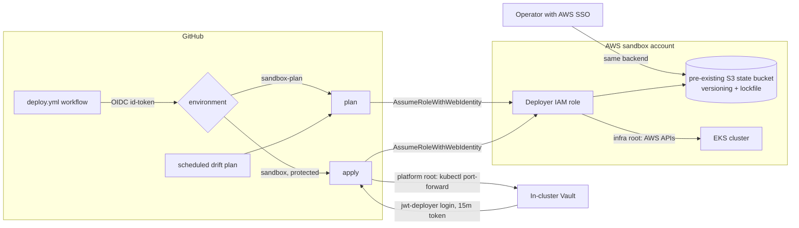

# Deploy the AgentGate sandbox

> **Static-validation status (2026-07-17):** This repository has not been
> applied to an AWS account. Passing Terraform validation and rendering Helm
> charts does not prove that a first deployment succeeds in a particular
> account or Region.

> **Runtime status:** The manifests wire HTTPS AgentGate, rotating SPIFFE
> identities, PostgreSQL, Vault management login, separate human auth, direct
> runner-to-Vault redemption, and a scrubbed Terraform plan. Both demo Jobs stay
> suspended until an operator publishes the reviewed image digest, checks the
> target, and intentionally releases one run. AWS/EKS/CloudTrail outcomes remain
> manual verification and must not be presented as observed until they are.

> **Cost warning:** EKS control-plane hours, two `t3.medium` nodes, one NAT
> gateway, public IPv4 addresses, EBS volumes, data transfer, and CloudWatch
> logs can all incur charges. Load balancers would add
> cost if introduced later. Review current AWS pricing before apply.
> **Destroy the sandbox when idle.**

## What is deployed

There are exactly four independent Terraform roots:

1. `deploy/bootstrap` (GitHub OIDC deployment trust)
2. `deploy/infra`
3. `deploy/platform`
4. `deploy/agentgate`

Apply in that order. Destroy in the exact reverse order. State for the three
sandbox roots lives in one pre-existing S3 bucket with native lock files;
each root carries a placeholder `backend "s3"` block completed by
`terraform init -backend-config`:

| Root | State | Execution |
| --- | --- | --- |
| `deploy/bootstrap` | Local file kept with operator bootstrap material | Operator only |
| `deploy/infra` | `s3://<state-bucket>/infra.tfstate` | Operator (AWS SSO) or GitHub Actions OIDC |
| `deploy/platform` | `s3://<state-bucket>/platform.tfstate` | Operator or GitHub Actions OIDC |
| `deploy/agentgate` | `s3://<state-bucket>/agentgate.tfstate` | Operator or GitHub Actions OIDC |

The bootstrap root creates the `token.actions.githubusercontent.com` IAM
OIDC provider and one deployer role trusted only for this repository's
`sandbox-plan` and `sandbox` GitHub environments, through the community
`terraform-module/github-oidc-provider/aws` module. The state bucket is
pre-provisioned and not managed by Terraform. See
[ADR-0001](adr/0001-deployment-control-plane.md) for the decision record.

## Deployment pipeline



Local applies and CI applies share the same state and the same identity
model: no static cloud or Vault credential exists anywhere. GitHub-hosted
runners need EKS API network access for the platform and agentgate roots;
either allow `0.0.0.0/0` explicitly (`allow_public_cluster_endpoint=true`,
IAM still authenticates every request) or run those roots from the operator
environment.

AgentGate is a credential-blind control plane:

- AgentGate may create, inspect, update, and delete only
  `auth/spire-jwt/role/agentgate-role-*` and
  `sys/policies/acl/agentgate-policy-*`.
- Those prefixes exclude AgentGate's own `agentgate-manager` role and
  `agentgate-management` policy, so its runtime authorization cannot expand
  itself.
- AgentGate has no policy capability on `aws/creds/*`.
- The governed runner authenticates directly to Vault with a JWT-SVID whose
  audience is `vault`.
- Every request role binds one exact runner subject:
  `spiffe://sandbox.agentgate.test/ns/agentgate-sandbox/sa/terraform-runner`.
- `request_id` must be supplied as Vault's `role_session_name`, so the AWS STS
  assumed-role session and CloudTrail retain the same correlation key.
- Demo Vault and AWS leases are capped at 15 minutes.
- Revoking a Vault lease or deleting a binding generally does **not**
  invalidate an already-issued AWS STS credential. It normally remains valid
  until expiry.
- Human OIDC or the PoC approver token is never accepted as workload identity.

The direct redemption contract is deliberately split from control-plane
configuration. AgentGate returns only a Vault address, auth mount,
request-scoped role, one secrets path, audience, and expiry. The governed
runner obtains its own short-lived JWT-SVID for audience `vault`, logs in
directly to the request role, and reads only that secrets path. Vault returns
the workload token and AWS STS response directly to the runner; neither passes
through AgentGate.

## Reviewed versions and official sources

All links in this section were checked on **2026-07-17**.

### Terraform and providers

Providers and community modules use pessimistic (`~>`) constraints; the
committed `.terraform.lock.hcl` in each root pins the exact provider versions
in use (dual-platform hashes) until `terraform init -upgrade` is run
deliberately. Community modules replace the hand-rolled VPC, EKS, and GitHub
OIDC resources.

| Component | Constraint | Official contract checked |
| --- | --- | --- |
| Terraform | `~> 1.15.6` (CLI `1.15.6`) | [CLI releases](https://releases.hashicorp.com/terraform/1.15.6/), [S3 backend](https://developer.hashicorp.com/terraform/language/backend/s3) |
| AWS provider | `~> 6.55` | [Provider releases](https://github.com/hashicorp/terraform-provider-aws/releases) |
| Kubernetes provider | `~> 3.2` | [Provider releases](https://github.com/hashicorp/terraform-provider-kubernetes/releases) |
| Helm provider | `~> 3.2` | [Provider releases](https://github.com/hashicorp/terraform-provider-helm/releases) |
| `terraform-aws-modules/vpc` | `~> 6.6` | [Module registry](https://registry.terraform.io/modules/terraform-aws-modules/vpc/aws) |
| `terraform-aws-modules/eks` | `~> 21.24` | [Module registry](https://registry.terraform.io/modules/terraform-aws-modules/eks/aws) |
| `terraform-module/github-oidc-provider` | `~> 2.2` | [Module registry](https://registry.terraform.io/modules/terraform-module/github-oidc-provider/aws) |
| Vault provider | `~> 5.10` | [Provider release](https://github.com/hashicorp/terraform-provider-vault/releases/tag/v5.10.1), [resource docs at tag](https://github.com/hashicorp/terraform-provider-vault/tree/v5.10.1/docs/resources) |

AWS arguments were checked against the `vpc`, `subnet`, `internet_gateway`,
`route_table`, `route_table_association`, `eip`, `nat_gateway`, `eks_cluster`,
`eks_node_group`, `eks_addon`, `eks_access_entry`,
`eks_access_policy_association`, `launch_template`, IAM role/policy,
`iam_openid_connect_provider`, KMS key/alias, CloudWatch log group, and S3
bucket/ownership/public-access/encryption/versioning/lifecycle resources in the
AWS provider documentation linked above. The design was also checked against:

- [EKS Kubernetes versions](https://docs.aws.amazon.com/eks/latest/userguide/kubernetes-versions.html)
- [EKS add-on versions](https://docs.aws.amazon.com/eks/latest/userguide/managing-add-ons.html#addon-versions)
- [EKS access entries](https://docs.aws.amazon.com/eks/latest/userguide/access-entries.html)
- [VPC CNI network policy](https://docs.aws.amazon.com/eks/latest/userguide/cni-network-policy-configure.html)
- [EKS envelope encryption](https://docs.aws.amazon.com/eks/latest/userguide/enable-kms.html)
- [IRSA](https://docs.aws.amazon.com/eks/latest/userguide/iam-roles-for-service-accounts.html)
- [IAM actions, resources, and condition keys](https://docs.aws.amazon.com/service-authorization/latest/reference/reference_policies_actions-resources-contextkeys.html)
- [EC2 authorization](https://docs.aws.amazon.com/AWSEC2/latest/UserGuide/iam-policies-for-amazon-ec2.html)
- [S3 policy resources](https://docs.aws.amazon.com/AmazonS3/latest/userguide/access-policy-language-overview.html)

Kubernetes provider arguments were checked against its namespace, service
account, ConfigMap, Deployment, Service, PodDisruptionBudget, NetworkPolicy,
Job, StorageClass, and manifest resource documentation. Kubernetes behavior
was checked against:

- [Pod Security Standards](https://kubernetes.io/docs/concepts/security/pod-security-standards/)
- [NetworkPolicy](https://kubernetes.io/docs/concepts/services-networking/network-policies/)
- [PodDisruptionBudget](https://kubernetes.io/docs/tasks/run-application/configure-pdb/)
- [suspended Jobs](https://kubernetes.io/docs/concepts/workloads/controllers/job/#suspending-a-job)
- [CSI volumes](https://kubernetes.io/docs/concepts/storage/volumes/#csi)
- [HTTPS probes](https://kubernetes.io/docs/tasks/configure-pod-container/configure-liveness-readiness-startup-probes/#http-probes)

Vault provider arguments were checked against `vault_audit`,
`vault_jwt_auth_backend`, `vault_jwt_auth_backend_role`,
`vault_aws_secret_backend`, `vault_aws_secret_backend_role`, and
`vault_policy`. The runtime API behavior was checked against:

- [Vault JWT auth](https://developer.hashicorp.com/vault/docs/auth/jwt)
- [Vault JWT role API](https://developer.hashicorp.com/vault/api-docs/auth/jwt#create-role)
- [Vault AWS secrets API](https://developer.hashicorp.com/vault/api-docs/secret/aws)
- [Vault AWS `role_session_name`](https://developer.hashicorp.com/vault/api-docs/secret/aws#generate-credentials)
- [Vault audit devices](https://developer.hashicorp.com/vault/docs/audit)
- [Vault integrated storage](https://developer.hashicorp.com/vault/docs/concepts/integrated-storage)

### Charts and images

| Artifact | Pin | Official source checked |
| --- | --- | --- |
| SPIRE chart | `0.29.0`, archive SHA-256 `b73205c87c5edfdaa5dcb6d6de16685950e02a5b8f843cdc6e101d127ef7a7be` | [Chart source at tag](https://github.com/spiffe/helm-charts-hardened/tree/spire-0.29.0/charts/spire), [release commit](https://github.com/spiffe/helm-charts-hardened/commit/890bd853e33e02a109b99d40712dfc9f9e3c90d9) |
| Vault chart | `0.34.0`, archive SHA-256 `a716f4fa8bb80e450ce7c0f9de7b475183c47437a162eee744cd40bf991244e9` | [Chart source at tag](https://github.com/hashicorp/vault-helm/tree/v0.34.0), [release commit](https://github.com/hashicorp/vault-helm/commit/8e4887ccec5dec2bf7168a229aaf5dc06e708ab6) |
| PostgreSQL chart | `18.8.0`, OCI digest `sha256:43f4d74fff2c12b93b542f10ff52c5f89d0de5ad64473cf88964cdfb76f5dc8c`, archive SHA-256 `fe14c233d3544f04a6d20831896273984e7ead129404f5205890deeebe5f18d9` | [Bitnami chart source](https://github.com/bitnami/charts/tree/main/bitnami/postgresql), [Artifact Hub](https://artifacthub.io/packages/helm/bitnami/postgresql) |
| SPIRE server/agent/OIDC | `1.15.1` | [SPIRE releases](https://github.com/spiffe/spire/releases/tag/v1.15.1) |
| SPIFFE CSI driver | `0.2.7` | [CSI driver releases](https://github.com/spiffe/spiffe-csi/releases/tag/v0.2.7) |
| SPIFFE Helper | `0.11.0`, amd64 digest `sha256:2759b3a699bb63b91cc5896f46cd6f70b9e3dfed9f7f4355a3a0a4e702984f9c` | [Helper release](https://github.com/spiffe/spiffe-helper/releases/tag/v0.11.0), [official GHCR package](https://github.com/spiffe/spiffe-helper/pkgs/container/spiffe-helper), [configuration contract](https://github.com/spiffe/spiffe-helper/blob/v0.11.0/README.md), [certificate file writer](https://github.com/spiffe/spiffe-helper/blob/v0.11.0/pkg/disk/x509.go) |
| SPIRE controller manager | `0.6.6` | [Controller manager releases](https://github.com/spiffe/spire-controller-manager/releases/tag/v0.6.6) |
| Vault server | `2.0.3` | [Vault releases](https://github.com/hashicorp/vault/releases/tag/v2.0.3), [official image](https://hub.docker.com/_/vault) |
| PostgreSQL image | digest `sha256:db2312d9b243afa8c3b3f5496e478d17d0dff9791d06f3b93b9567abd86ae92f` | [Bitnami PostgreSQL container](https://github.com/bitnami/containers/tree/main/bitnami/postgresql) |
| Go builder | `1.24.13-alpine3.23@sha256:8bee1901f1e530bfb4a7850aa7a479d17ae3a18beb6e09064ed54cfd245b7191` | [Go downloads](https://go.dev/dl/#go1.24.13), [Docker Official Image](https://hub.docker.com/_/golang) |
| Distroless runtime | `static-debian13:nonroot@sha256:f7f8f729987ad0fdf6b05eeeae94b26e6a0f613bdf46feea7fc40f7bd72953e6` | [Distroless repository](https://github.com/GoogleContainerTools/distroless) |
| kubectl in deploy workflow | `1.36.1`, linux/amd64 sha256 `629d3f410e09bf49b64ae7079f7f0bda1191efed311f7d37fdbab0ad5b0ec2b7` | [kubectl install docs](https://kubernetes.io/docs/tasks/tools/install-kubectl-linux/), [release binaries](https://dl.k8s.io/release/v1.36.1/bin/linux/amd64/) |

The SPIRE umbrella chart advertises app version `1.14.5`, while its packaged
component charts select `1.15.1`. The values file explicitly pins each SPIRE
component image to the reviewed version. Chart-owned helper images are pinned
to release tags or immutable digests. `deploy/scripts/render-charts.sh` renders
the exact selected charts and asserts image, probe, security-context, volume,
registration, and network-policy properties.

The application arguments in `deploy/agentgate` were checked against
`cmd/agentgate/serve.go` and `cmd/agent-sim/main.go` on 2026-07-17. SPIFFE
Helper writes renewed certificate and key files separately; AgentGate therefore
reloads only a matching pair and retains the last unexpired valid pair during
that short write window. `cmd/agentgate/serve_tls_test.go` covers this behavior.

### State backend and CI

- [Terraform S3 backend and native state locking](https://developer.hashicorp.com/terraform/language/backend/s3)
- [GitHub OIDC with AWS](https://docs.github.com/en/actions/deployment/security-hardening-your-deployments/configuring-openid-connect-in-amazon-web-services)
- [GitHub Actions environments and required reviewers](https://docs.github.com/en/actions/deployment/targeting-different-environments/using-environments-for-deployment)
- [Vault JWT auth method](https://developer.hashicorp.com/vault/docs/auth/jwt)
- [Terraform remote state data source](https://developer.hashicorp.com/terraform/language/state/remote-state-data)

The committed dependency locks include package hashes for the Apple Silicon
development environment and the Linux amd64 CI environment. Whenever a
provider pin changes, regenerate every root with both platforms before using
`-lockfile=readonly`:

```bash
for root in bootstrap infra platform agentgate; do
  terraform -chdir="deploy/${root}" providers lock \
    -platform=darwin_arm64 \
    -platform=linux_amd64
done
```

Do not commit a lock regenerated by plain `terraform init` on only one
platform; the missing package hash will make initialization or validation fail
on the other platform.

CI actions are immutable commit pins: checkout `v4.3.1`, setup-node `v4.4.0`,
setup-go `v5.6.0`, golangci-lint-action `v8.0.0`, setup-opa `v2.4.0`,
setup-terraform `v4.0.1`, setup-helm `v4.3.1`, action-shellcheck `2.0.0`, and
configure-aws-credentials `v5.1.1`.
Their release pages and action inputs were checked in their official GitHub
repositories: [checkout](https://github.com/actions/checkout/releases/tag/v4.3.1),
[setup-node](https://github.com/actions/setup-node/releases/tag/v4.4.0),
[setup-go](https://github.com/actions/setup-go/releases/tag/v5.6.0),
[golangci-lint-action](https://github.com/golangci/golangci-lint-action/releases/tag/v8.0.0),
[setup-opa](https://github.com/open-policy-agent/setup-opa/releases/tag/v2.4.0),
[setup-terraform](https://github.com/hashicorp/setup-terraform/releases/tag/v4.0.1),
[setup-helm](https://github.com/Azure/setup-helm/releases/tag/v4.3.1),
[action-shellcheck](https://github.com/ludeeus/action-shellcheck/releases/tag/2.0.0), and
[configure-aws-credentials](https://github.com/aws-actions/configure-aws-credentials/releases/tag/v5.1.1).

## Prerequisites

Use a dedicated AWS sandbox account. Do not deploy this reference into a
shared production account.

Required:

- AWS sandbox account and an AWS SSO role for the human operator;
- an existing S3 bucket for Terraform state (versioned and encrypted;
  this reference does not create it);
- a GitHub repository (this one or a fork) if CI-driven deploys and drift
  detection are wanted; local-only operation needs no GitHub setup;
- an OCI registry for the locally built application image;
- one HTTPS, Slack-compatible approval webhook endpoint for the sandbox;
- Terraform `1.15.6`;
- AWS CLI v2;
- kubectl `1.36.x`;
- Helm 3.x or 4.x (statically checked with `4.2.0`);
- Vault CLI compatible with Vault 2.x;
- `curl`, `jq`, OpenSSL, and ShellCheck;
- a protected directory outside the repository for bootstrap material.

Set non-secret context:

```bash
export AGENTGATE_AWS_ACCOUNT_ID='111122223333'
export AGENTGATE_AWS_REGION='ap-southeast-1'
export AGENTGATE_STATE_BUCKET='replace-me-tfstate'
export AGENTGATE_CLUSTER_NAME='agentgate-sandbox-eks'
export AGENTGATE_SECRET_DIR="${HOME}/.agentgate-sandbox-secrets"
export AGENTGATE_ACKNOWLEDGE_COSTS='yes'
mkdir -p "${AGENTGATE_SECRET_DIR}"
chmod 0700 "${AGENTGATE_SECRET_DIR}"
```

`AGENTGATE_STATE_BUCKET` is the existing state bucket; every root points its
`backend "s3"` placeholder at it through
`terraform init -backend-config` (`deploy/scripts/init-root.sh`).

Expected: no command prints credential material. The secret directory mode is
`drwx------`.

Authenticate the human operator with AWS SSO. Do not export AWS key variables:

```bash
aws sso login --profile replace-me
export AWS_PROFILE='replace-me'
aws sts get-caller-identity \
  --query '{Account:Account,Arn:Arn}' \
  --output json
```

Expected shape:

```json
{"Account":"111122223333","Arn":"arn:aws:sts::111122223333:assumed-role/.../..."}
```

The ARN must be the expected human SSO role. The account must match
`AGENTGATE_AWS_ACCOUNT_ID`.

Prove that static AWS variables are absent:

```bash
test -z "${AWS_ACCESS_KEY_ID:-}"
test -z "${AWS_SECRET_ACCESS_KEY:-}"
test -z "${AWS_SESSION_TOKEN:-}"
```

`deploy/scripts/preflight.sh --local` runs after the bootstrap apply.

## Bootstrap the deployment trust

The bootstrap root creates the GitHub Actions IAM OIDC provider and one
deployer role trusted only for this repository's `sandbox-plan` and `sandbox`
GitHub environments, using the community
`terraform-module/github-oidc-provider/aws` module. The state bucket is
assumed to exist already and is not managed by any root. Bootstrap keeps
local state; the state file contains only public identifiers. Keep it with
the operator bootstrap material.

```bash
terraform -chdir=deploy/bootstrap init -input=false
terraform -chdir=deploy/bootstrap plan -input=false \
  -var "aws_region=${AGENTGATE_AWS_REGION}" \
  -var 'github_repository=replace-me/agentgate'
terraform -chdir=deploy/bootstrap apply -input=false \
  -var "aws_region=${AGENTGATE_AWS_REGION}" \
  -var 'github_repository=replace-me/agentgate'
```

If the account already has a `token.actions.githubusercontent.com` OIDC
provider, add `-var create_github_oidc_provider=false` and
`-var existing_github_oidc_provider_arn=...`.

Record the non-secret outputs and run preflight:

```bash
export AGENTGATE_DEPLOYER_ROLE_ARN="$(
  terraform -chdir=deploy/bootstrap output -raw deployer_role_arn
)"
export AGENTGATE_EKS_PUBLIC_ACCESS_CIDRS='["203.0.113.10/32"]'
export AGENTGATE_OPERATOR_PRINCIPAL_ARNS='["arn:aws:iam::111122223333:role/replace-me-sso-role"]'
deploy/scripts/preflight.sh --local
```

Expected final line:

```text
Preflight passed without static AWS credential material.
```

Use the operator's real public egress `/32`, not the documentation address.
`0.0.0.0/0` is rejected unless `allow_public_cluster_endpoint=true` is set
deliberately for CI-driven cluster applies; the endpoint then still requires
IAM authentication for every request.

### GitHub repository configuration (optional, for CI deploys and drift)

In the repository settings:

1. Create environment `sandbox-plan` with no protection rules and
   environment `sandbox` with required reviewers. The deployer role trusts
   only these two environment subjects; pull requests and pushes cannot
   assume it.
2. Create Actions variables:

```text
AGENTGATE_STATE_BUCKET            = <existing state bucket name>
AGENTGATE_AWS_REGION              = <sandbox region>
AGENTGATE_DEPLOYER_ROLE_ARN       = <bootstrap output deployer_role_arn>
AGENTGATE_EKS_PUBLIC_ACCESS_CIDRS = <JSON list of allowed CIDRs>
AGENTGATE_ALLOW_PUBLIC_CLUSTER_ENDPOINT = false
AGENTGATE_OPERATOR_PRINCIPAL_ARNS = <JSON list, may be []>
AGENTGATE_CLUSTER_NAME            = agentgate-sandbox-eks
AGENTGATE_VAULT_CONFIGURED        = false
```

`AGENTGATE_VAULT_CONFIGURED` flips to `true` only after the Vault bootstrap
below; `AGENTGATE_APPLICATION_IMAGE` is added before layer 3. No variable is
a secret; the workflow holds no static credential of any kind.

## Static validation before any plan

Run exactly:

```bash
terraform fmt -check -recursive deploy

for root in bootstrap infra platform agentgate; do
  terraform -chdir="deploy/${root}" init \
    -backend=false \
    -input=false \
    -lockfile=readonly
  terraform -chdir="deploy/${root}" validate
done

render_dir="$(mktemp -d)"
deploy/scripts/render-charts.sh "${render_dir}"
deploy/scripts/assert-agentgate-static.sh
terraform -chdir=deploy/bootstrap test
terraform -chdir=deploy/agentgate test
shellcheck deploy/scripts/*.sh deploy/scripts/lib/*.sh
rm -rf "${render_dir}"
```

Expected for each root:

```text
Terraform has been successfully initialized!
Success! The configuration is valid.
```

Expected chart result:

```text
Rendered chart manifests passed static assertions in ...
Success! 2 passed, 0 failed.
Success! 1 passed, 0 failed.
```

This is static evidence only.

## Apply layer 1: infrastructure

Initialize against the S3 backend, export the root's variables, and inspect
the plan:

```bash
export TF_VAR_deployer_role_arn="${AGENTGATE_DEPLOYER_ROLE_ARN}"
export TF_VAR_cluster_endpoint_public_access_cidrs="${AGENTGATE_EKS_PUBLIC_ACCESS_CIDRS}"
export TF_VAR_operator_access_principal_arns="${AGENTGATE_OPERATOR_PRINCIPAL_ARNS}"
deploy/scripts/init-root.sh infra
terraform -chdir=deploy/infra plan -input=false
```

Expected plan shape includes:

- one VPC;
- two public and two private subnets;
- one NAT gateway;
- one EKS 1.36 cluster;
- one managed node group with desired/min/max count `2/2/2`;
- only `t3.medium` node instances;
- VPC CNI, CoreDNS, kube-proxy, and EBS CSI add-ons;
- EKS access entries for the deployer role and operator SSO roles;
- separate Vault broker and demo target roles;
- one private, encrypted, versioned S3 demo bucket.

Review every create action and the current pricing. Apply either from the
operator environment or through the deploy workflow (`root=infra`,
`action=apply`, approved in the protected `sandbox` environment):

```bash
terraform -chdir=deploy/infra apply -input=false
```

Expected: the apply ends with `Apply complete!`. This document does not claim
that result has been observed.

Capture only non-secret outputs:

```bash
export AGENTGATE_CLUSTER_NAME="$(
  terraform -chdir=deploy/infra output -raw cluster_name
)"
```

Configure kubectl:

```bash
aws eks update-kubeconfig \
  --name "${AGENTGATE_CLUSTER_NAME}" \
  --region "${AGENTGATE_AWS_REGION}" \
  --alias "${AGENTGATE_CLUSTER_NAME}"
deploy/scripts/preflight.sh --cluster
kubectl get nodes -o wide
```

Expected: exactly two Ready `t3.medium` worker nodes. Confirm the account and
cluster context before proceeding.

Validate add-on availability in the actual Region:

```bash
aws eks describe-addon-versions \
  --region "${AGENTGATE_AWS_REGION}" \
  --kubernetes-version 1.36 \
  --addon-name aws-ebs-csi-driver \
  --query 'addons[0].addonVersions[].addonVersion' \
  --output text
```

Expected: the output includes `v1.62.0-eksbuild.1`. If not, stop and review a
new pin; do not let AWS silently choose a default.

## Bootstrap platform prerequisites

Create platform namespaces and the generated PostgreSQL runtime Secrets. The
same generated password is referenced by PostgreSQL in `agentgate-platform`
and SPIRE server in `spire-system`; no value enters Terraform:

```bash
deploy/scripts/bootstrap-platform.sh
```

Expected:

```text
Platform namespaces and PostgreSQL runtime Secret are ready.
```

No password is printed or stored in Terraform state.

## Apply layer 2: platform, first pass

The first pass leaves `vault_configuration_enabled=false`. It installs
PostgreSQL, applies the forward migrations, installs SPIRE, and installs a
sealed Vault. It does not attempt Vault provider resources.

```bash
export TF_VAR_state_bucket="${AGENTGATE_STATE_BUCKET}"
export TF_VAR_state_bucket_region="${AGENTGATE_AWS_REGION}"
deploy/scripts/init-root.sh platform
terraform -chdir=deploy/platform plan -input=false
terraform -chdir=deploy/platform apply -input=false
```

Expected plan shape:

- encrypted gp3 StorageClass with sandbox `Delete` reclaim behavior;
- PostgreSQL `18.8.0`, one persistent primary, and migration Job;
- SPIRE server, agent DaemonSet, CSI driver, OIDC discovery provider, and exact
  Vault registration;
- one Vault HA/Raft-configured replica, data/audit PVCs, SPIFFE-managed TLS,
  and narrow NetworkPolicy;
- namespace default-deny policies plus explicit SPIRE internal, Kubernetes API,
  PostgreSQL, OIDC-to-Vault, DNS, and migration paths;
- zero Vault provider resources on this first pass.

Expected runtime shape:

```bash
kubectl get pods -A
kubectl get pvc -A
kubectl get job agentgate-migrations-v2 -n agentgate-platform
```

- PostgreSQL, SPIRE server/agent/OIDC, and the migration Job are Ready or
  Complete.
- Vault is Running but sealed and not Ready.
- No Service is `LoadBalancer`; all selected Services are `ClusterIP`.

## Initialize and bootstrap Vault

Vault initialization and unseal material crosses a deliberate manual security
boundary. Do not put it in Terraform, Kubernetes Secrets, shell history, chat,
or CI logs. Production replaces this with KMS-backed auto-unseal and a formal
key ceremony.

Extract the public SPIRE CA bundle and start a TLS port-forward:

```bash
kubectl get configmap spire-bundle \
  --namespace spire-system \
  -o jsonpath='{.data.bundle\.crt}' \
  >"${AGENTGATE_SECRET_DIR}/spire-ca.pem"
chmod 0644 "${AGENTGATE_SECRET_DIR}/spire-ca.pem"

kubectl port-forward --namespace vault service/vault 8200:8200
```

Keep the port-forward in a dedicated terminal. In another terminal:

```bash
export VAULT_ADDR='https://127.0.0.1:8200'
export VAULT_CACERT="${AGENTGATE_SECRET_DIR}/spire-ca.pem"
export VAULT_TLS_SERVER_NAME='vault.vault.svc.cluster.local'
vault status -format=json | jq '{initialized,sealed,storage_type}'
```

Expected before initialization:

```json
{"initialized":false,"sealed":true,"storage_type":"raft"}
```

Initialize once:

```bash
umask 077
vault operator init \
  -key-shares=3 \
  -key-threshold=2 \
  -format=json \
  >"${AGENTGATE_SECRET_DIR}/vault-init.json"
chmod 0600 "${AGENTGATE_SECRET_DIR}/vault-init.json"
```

If `initialized` was already true, **do not run this command again**. Restore
the original material or follow a documented recovery process.

Use two different unseal keys from the protected file with interactive
`vault operator unseal` prompts. Never put an unseal key on the command line.
Then extract the initial root token only to another protected file:

```bash
jq -r '.root_token' \
  "${AGENTGATE_SECRET_DIR}/vault-init.json" \
  >"${AGENTGATE_SECRET_DIR}/vault-root-token"
chmod 0600 "${AGENTGATE_SECRET_DIR}/vault-root-token"
vault status -format=json | jq '{initialized,sealed,ha_enabled}'
```

Expected:

```json
{"initialized":true,"sealed":false,"ha_enabled":true}
```

Bootstrap the deployment trust inside Vault:

```bash
export VAULT_TOKEN_FILE="${AGENTGATE_SECRET_DIR}/vault-root-token"
export AGENTGATE_GITHUB_REPOSITORY='replace-me/agentgate'   # omit for local-only
deploy/scripts/bootstrap-vault.sh
```

This writes the `terraform-platform` policy, which manages only platform
configuration paths and has no `aws/creds/*` path. When
`AGENTGATE_GITHUB_REPOSITORY` is set it also enables a `jwt-deployer` JWT
auth mount trusting GitHub's OIDC issuer with `sub` bound to exactly:

```text
repo:<owner>/<repo>:environment:sandbox-plan
repo:<owner>/<repo>:environment:sandbox
```

audience `agentgate-vault`, 15-minute tokens, and only the
`terraform-platform` policy. No Vault credential is stored in GitHub; the
deploy workflow exchanges its per-job OIDC identity token at run time
(`deploy/scripts/ci-vault-env.sh`).

If CI deploys are wanted, flip the repository variable now:

```text
AGENTGATE_VAULT_CONFIGURED = true
```

## Apply layer 2: Vault configuration pass

Locally, mint a short-lived scoped token instead of applying with the root
token, keep the TLS port-forward running, and apply:

```bash
export VAULT_TOKEN="$(<"${VAULT_TOKEN_FILE}")"
scoped_token="$(vault token create -policy=terraform-platform -ttl=30m -orphan -field=token)"
export VAULT_TOKEN="${scoped_token}"
unset scoped_token
export VAULT_TLS_SERVER_NAME='vault.vault.svc.cluster.local'
export TF_VAR_vault_configuration_enabled=true
terraform -chdir=deploy/platform plan -input=false
terraform -chdir=deploy/platform apply -input=false
unset VAULT_TOKEN
```

Through CI instead: run the deploy workflow with `root=platform` after
setting `AGENTGATE_VAULT_CONFIGURED=true`; the workflow port-forwards Vault,
logs in through `jwt-deployer`, and applies with the same variables.

Expected additional resources:

- writable file audit device;
- SPIRE JWT auth at `spire-jwt`;
- AWS secrets engine at `aws`;
- `terraform-sandbox` assumed-role definition with default/max STS TTL `900`;
- `agentgate-management` policy;
- exact AgentGate JWT role with audience `vault`.

### Exact AgentGate runtime management policy

The `agentgate-manager` role receives only the following policy (with the
configured JWT mount substituted for `spire-jwt`):

```hcl
path "auth/spire-jwt/role/agentgate-role-*" {
  capabilities = ["create", "read", "update", "delete"]
}

path "sys/policies/acl/agentgate-policy-*" {
  capabilities = ["create", "read", "update", "delete"]
}
```

There is intentionally no capability on `aws/creds/*`, token or identity
paths, the management role or policy, or `sys/leases/revoke-prefix/*`.
`AccessBinding` and `RedemptionDescriptor` contain no lease identifier, and
AgentGate must not obtain one by reading a credential response. A role-wide
lease prefix would also revoke unrelated requests that use the same AWS role.
The current manager therefore reports `leases_revoked=false`, removes the
request role and policy, and warns that issued AWS STS credentials may remain
valid until expiry. If a future credential-free channel provides an exact
request lease identifier, best-effort cleanup can be attempted without
crossing the data-plane boundary.

Inspect non-secret configuration while the initial root token remains
available:

```bash
export VAULT_TOKEN="$(<"${VAULT_TOKEN_FILE}")"
vault audit list -format=json | jq 'keys'
vault auth list -format=json | jq 'keys'
vault secrets list -format=json | jq 'keys'
vault read -format=json auth/spire-jwt/role/agentgate-manager |
  jq '.data | {bound_audiences,bound_subject,token_policies,token_ttl,token_max_ttl,token_no_default_policy}'
vault read -format=json aws/roles/terraform-sandbox |
  jq '.data | {credential_types,role_arns,default_sts_ttl,max_sts_ttl}'
vault policy read agentgate-management
unset VAULT_TOKEN
```

Expected:

- audit keys include `file/`;
- auth keys include `spire-jwt/` and, when CI trust is enabled,
  `jwt-deployer/`;
- secrets keys include `aws/`;
- AgentGate's bound subject is
  `spiffe://sandbox.agentgate.test/ns/agentgate/sa/agentgate`;
- audience is `vault`;
- the management policy contains only the exact `agentgate-role-*` and
  `agentgate-policy-*` control paths;
- it contains no `read` capability on any `aws/creds/*` path.

After the configuration pass succeeds (and, when CI trust is enabled, a
workflow plan has authenticated through `jwt-deployer`), retire the initial
root token according to your recovery policy. For this disposable sandbox:

```bash
export VAULT_TOKEN="$(<"${VAULT_TOKEN_FILE}")"
vault token revoke -self
unset VAULT_TOKEN
rm -f "${VAULT_TOKEN_FILE}"
unset VAULT_TOKEN_FILE
```

Keep unseal keys in approved protected storage until destroy. A Vault restart
requires manual unseal in this sandbox.

Verify migration completion without printing a password:

```bash
kubectl get job agentgate-migrations-v2 \
  --namespace agentgate-platform \
  -o jsonpath='{.status.succeeded}{"\n"}'

kubectl exec \
  --namespace agentgate-platform \
  statefulset/agentgate-postgresql \
  -- bash -ec \
  'PGPASSWORD="${POSTGRES_PASSWORD}" psql -U agentgate -d agentgate -tAc "SELECT to_regclass('\''public.access_requests'\''), to_regclass('\''public.audit_events'\''), position('\''revoking'\'' IN pg_get_constraintdef(oid)) > 0 FROM pg_constraint WHERE conname = '\''access_requests_binding_state_check'\'';"'
```

Expected: job success `1`, both relation names, and `t` for the forward expiry
migration. The password remains an environment value inside the database
container and is not printed.

## Build and apply layer 3

Build from a reviewed revision containing the integrated API and runner. The
runner Job remains suspended by default because direct Vault redemption can mint
real short-lived AWS STS values.

```bash
export APP_REGISTRY='ghcr.io/replace-me/agentgate'
export APP_TAG='replace-with-reviewed-version'
docker build \
  --platform linux/amd64 \
  --file deploy/images/Dockerfile \
  --tag "${APP_REGISTRY}:${APP_TAG}" \
  .
docker push "${APP_REGISTRY}:${APP_TAG}"
docker pull "${APP_REGISTRY}:${APP_TAG}"
export AGENTGATE_APPLICATION_IMAGE="$(
  docker image inspect \
    --format '{{index .RepoDigests 0}}' \
    "${APP_REGISTRY}:${APP_TAG}"
)"
test -n "${AGENTGATE_APPLICATION_IMAGE}"
```

Prepare the approval webhook reference without putting it in a command
argument. The endpoint must accept the credential-free JSON notification and
return a 2xx status:

```bash
umask 077
read -r -s -p 'Sandbox HTTPS approval webhook URL: ' approval_webhook_url
printf '%s' "${approval_webhook_url}" \
  >"${AGENTGATE_SECRET_DIR}/approval-webhook-url"
unset approval_webhook_url
printf '\n'
chmod 0600 "${AGENTGATE_SECRET_DIR}/approval-webhook-url"
```

Expose only the immutable image reference to Terraform (and, for CI deploys,
set the same value as the `AGENTGATE_APPLICATION_IMAGE` repository variable):

```bash
export TF_VAR_application_image="${AGENTGATE_APPLICATION_IMAGE}"
```

Plan and apply:

```bash
deploy/scripts/init-root.sh agentgate
terraform -chdir=deploy/agentgate plan -input=false
terraform -chdir=deploy/agentgate apply -input=false
deploy/scripts/bootstrap-agentgate.sh
kubectl rollout status deployment/agentgate \
  --namespace agentgate \
  --timeout=180s
deploy/scripts/verify-cluster.sh
```

Expected plan shape:

- `agentgate` and `agentgate-sandbox` restricted namespaces;
- three service accounts with token automount disabled and no RBAC grants;
- two AgentGate replicas on HTTPS port 8443, ClusterIP Service, HTTPS probes,
  resources, hardening, topology spread, and PodDisruptionBudget;
- one pinned SPIFFE Helper init container and sidecar per AgentGate pod, with
  the Workload API and a private in-memory TLS volume;
- runtime Secret references for the PostgreSQL URL, approval webhook, and
  PoC-only human token; no secret value enters Terraform;
- exact `agentgate serve` arguments for TLS, trust domain, dispatcher public
  key, Vault TLS/JWT management identity, and the selected human auth rail;
- the authorization policy embedded in the reviewed application image, with
  its source hash recorded on the Pod template;
- default-deny and narrow allow NetworkPolicies;
- exact AgentGate and runner `ClusterSPIFFEID` objects;
- one suspended dispatcher Job and one suspended runner Job;
- no AWS keys, Vault tokens, or agent credential Secret.

`bootstrap-agentgate.sh` reads the platform PostgreSQL password without
displaying it, assembles the connection URL only in a protected temporary file,
creates the PoC human token and webhook Secret, keeps the dispatcher private key
only in the dispatcher namespace Secret, publishes only the dispatcher public
key to AgentGate, and restarts the Deployment so environment references are
refreshed.

Expected healthy shape:

```bash
kubectl get deployment,service,pods --namespace agentgate
kubectl get pod --namespace agentgate \
  --selector app.kubernetes.io/name=agentgate \
  -o json |
  jq '[.items[].spec.containers[].name]'
```

The Deployment reports `2/2` available, the Service exposes only `8443/TCP`,
and each Pod has `agentgate` plus `spiffe-helper` containers. The init container
has completed.

Check the unauthenticated health surfaces over the real TLS listener. Keep the
port-forward in a separate terminal:

```bash
kubectl port-forward --namespace agentgate service/agentgate 8443:8443
```

Then:

```bash
export AGENTGATE_TLS_NAME='agentgate.agentgate.svc.cluster.local'
curl --fail --silent --show-error \
  --noproxy '*' \
  --cacert "${AGENTGATE_SECRET_DIR}/spire-ca.pem" \
  --resolve "${AGENTGATE_TLS_NAME}:8443:127.0.0.1" \
  "https://${AGENTGATE_TLS_NAME}:8443/livez" |
  jq '{status,version}'
curl --fail --silent --show-error \
  --noproxy '*' \
  --cacert "${AGENTGATE_SECRET_DIR}/spire-ca.pem" \
  --resolve "${AGENTGATE_TLS_NAME}:8443:127.0.0.1" \
  "https://${AGENTGATE_TLS_NAME}:8443/readyz" |
  jq '{status,version}'
```

Expected for both: `status` is `ok`; readiness also proves the schema checks
can reach PostgreSQL.

During the first sandbox deployment, prove that the 15-minute server X509-SVID
rotates while the listener stays healthy:

```bash
agentgate_tls_serial() {
  openssl s_client \
    -connect 127.0.0.1:8443 \
    -servername "${AGENTGATE_TLS_NAME}" \
    -verify_hostname "${AGENTGATE_TLS_NAME}" \
    -verify_return_error \
    -CAfile "${AGENTGATE_SECRET_DIR}/spire-ca.pem" \
    </dev/null 2>/dev/null |
    openssl x509 -noout -serial
}
serial_before="$(agentgate_tls_serial)"
sleep 16m
serial_after="$(agentgate_tls_serial)"
test "${serial_before}" != "${serial_after}"
```

Expected: the serial changes and a subsequent `/readyz` request still returns
`status: ok`. Stop the port-forward after the checks.

## SPIRE identity checks

Inspect registrations:

```bash
kubectl get clusterspiffeid \
  agentgate-control-plane \
  agentgate-terraform-runner \
  -o yaml
```

Expected exact subjects:

```text
spiffe://sandbox.agentgate.test/ns/agentgate/sa/agentgate
spiffe://sandbox.agentgate.test/ns/agentgate-sandbox/sa/terraform-runner
```

Each registration must have:

- one exact namespace selector;
- pod labels for only the intended workload;
- both `k8s:ns:<namespace>` and `k8s:sa:<service-account>` workload selectors;
- JWT TTL `5m`;
- X.509 TTL `15m`.

Fetch an X509-SVID only from a temporary pod carrying the governed runner's
exact namespace, service account, and labels:

```bash
kubectl apply -f - <<'YAML'
apiVersion: v1
kind: Pod
metadata:
  name: agentgate-svid-check
  namespace: agentgate-sandbox
  labels:
    app.kubernetes.io/name: agent-sim
    app.kubernetes.io/instance: agentgate-demo
    app.kubernetes.io/component: governed-runner
    app.kubernetes.io/part-of: agentgate
    app.kubernetes.io/managed-by: terraform
spec:
  serviceAccountName: terraform-runner
  automountServiceAccountToken: false
  restartPolicy: Never
  securityContext:
    runAsNonRoot: true
    runAsUser: 65532
    runAsGroup: 65532
    fsGroup: 65532
    seccompProfile:
      type: RuntimeDefault
  containers:
    - name: fetch-svid
      image: ghcr.io/spiffe/spire-agent:1.15.1
      command: [/opt/spire/bin/spire-agent]
      args:
        - api
        - fetch
        - x509
        - -socketPath
        - /run/spire/sockets/spire-agent.sock
        - -write
        - /svid
      resources:
        requests:
          cpu: 10m
          memory: 16Mi
        limits:
          cpu: 100m
          memory: 64Mi
      securityContext:
        allowPrivilegeEscalation: false
        readOnlyRootFilesystem: true
        capabilities:
          drop: [ALL]
      volumeMounts:
        - name: workload-api
          mountPath: /run/spire/sockets
          readOnly: true
        - name: svid
          mountPath: /svid
  volumes:
    - name: workload-api
      csi:
        driver: csi.spiffe.io
        readOnly: true
    - name: svid
      emptyDir:
        sizeLimit: 1Mi
YAML
kubectl wait pod/agentgate-svid-check \
  --namespace agentgate-sandbox \
  --for=jsonpath='{.status.phase}'=Succeeded \
  --timeout=60s
kubectl logs pod/agentgate-svid-check --namespace agentgate-sandbox
kubectl delete pod/agentgate-svid-check --namespace agentgate-sandbox
```

The `-write` destination is pod-local `emptyDir`; do not copy or print its
private key. Expected output contains:

```text
SPIFFE ID: spiffe://sandbox.agentgate.test/ns/agentgate-sandbox/sa/terraform-runner
```

From Vault, verify SPIRE discovery and JWKS over TLS:

```bash
kubectl exec --namespace vault vault-0 -- \
  vault write -field=token auth/spire-jwt/login \
  role=agentgate-manager \
  jwt=not-a-real-jwt >/dev/null
```

Expected: authentication fails because the placeholder is not a valid
AgentGate JWT-SVID. A real matching workload JWT is used only inside the
workload and is never printed.

To inspect reachability without a JWT:

```bash
kubectl exec --namespace vault vault-0 -- \
  wget -qO- \
  --ca-certificate=/vault/tls/ca.pem \
  https://spire-spiffe-oidc-discovery-provider.spire-system.svc.cluster.local/.well-known/openid-configuration |
  jq '{issuer,jwks_uri}'
```

Expected: both fields use the configured in-cluster SPIRE OIDC issuer. If the
Vault image lacks `wget`, use an approved pinned diagnostics image in the Vault
namespace; do not weaken the NetworkPolicy.

## End-to-end direct redemption

This run reaches the real Vault AWS secrets engine and can mint short-lived AWS
STS values. Review the target, image digest, current cost, and suspended Job
before releasing it.

Prepare a fresh 15-minute dispatcher-signed grant:

```bash
deploy/scripts/prepare-demo-grant.sh
```

Expected output contains only its `request_id`. The private key and signed grant
body are not printed, and the runner remains suspended.

Release the runner once:

```bash
kubectl patch job agentgate-demo-runner \
  --namespace agentgate-sandbox \
  --type merge \
  --patch '{"spec":{"suspend":false}}' >/dev/null
kubectl wait job/agentgate-demo-runner \
  --namespace agentgate-sandbox \
  --for=condition=complete \
  --timeout=900s
runner_log="$(mktemp)"
chmod 0600 "${runner_log}"
kubectl logs job/agentgate-demo-runner \
  --namespace agentgate-sandbox \
  --container agent-sim >"${runner_log}"
export REQUEST_ID="$(tail -n 1 "${runner_log}" | jq -er '.request_id')"
```

`agent-sim` performs the full path in one process:

1. fetch its rotating X509-SVID;
2. send the signed grant to AgentGate over mTLS;
3. poll a pending approval when required;
4. receive only a credential-free descriptor;
5. fetch its own JWT-SVID for audience `vault`, with a maximum five-minute
   lifetime;
6. log in directly to the request-scoped Vault role;
7. read exactly `aws/creds/terraform-sandbox`, sending `request_id` as
   `role_session_name` and the remaining TTL;
8. pass STS values only in a minimal Terraform child environment;
9. run `terraform plan` for one marker object under the governed prefix;
10. clear references, delete the ephemeral Terraform directory, and print
    credential-free JSON.

Inspect the scrubbed Terraform output and final result:

```bash
sed -n '/----- terraform init (scrubbed) -----/,$p' "${runner_log}"
tail -n 1 "${runner_log}" |
  jq '{
    request_id,
    spiffe_id,
    decision,
    approval_state,
    binding_state,
    vault_auth_role,
    aws_role_session_name,
    terraform
  }'
```

Expected final shape:

```json
{
  "request_id": "<same UUID throughout>",
  "spiffe_id": "spiffe://sandbox.agentgate.test/ns/agentgate-sandbox/sa/terraform-runner",
  "decision": "allow",
  "approval_state": "not_required",
  "binding_state": "enabled",
  "vault_auth_role": "agentgate-role-<same UUID>",
  "aws_role_session_name": "<same UUID>",
  "terraform": {
    "initialized": true,
    "plan_completed": true,
    "changes_present": true
  }
}
```

The plan is not applied. Validate that the final JSON has no credential-bearing
field:

```bash
tail -n 1 "${runner_log}" |
  jq -e '
    [
      paths(scalars) as $p |
      ($p[-1] | tostring | ascii_downcase) |
      select(
        test("access.?key|secret.?key|session.?token|security.?token|vault.?token|lease.?id")
      )
    ] | length == 0
  '
```

Expected: `true`. Terraform stdout/stderr is bounded to 1 MiB and scrubbed
before it is written to the Job log.

Inspect the human operational record without placing the PoC token in a curl
argument:

```bash
human_curl_config="$(mktemp)"
chmod 0600 "${human_curl_config}"
printf 'header = "Authorization: Bearer %s"\n' \
  "$(<"${AGENTGATE_SECRET_DIR}/approver-token")" \
  >"${human_curl_config}"
curl --silent --show-error \
  --config "${human_curl_config}" \
  --noproxy '*' \
  --cacert "${AGENTGATE_SECRET_DIR}/spire-ca.pem" \
  --resolve "${AGENTGATE_TLS_NAME}:8443:127.0.0.1" \
  "https://${AGENTGATE_TLS_NAME}:8443/v1/requests/${REQUEST_ID}" |
  jq '{
    request_id: .request.request_id,
    spiffe_id: .request.spiffe_id,
    on_behalf_of: .request.on_behalf_of,
    ticket_id: .request.ticket_id,
    policy_version: .request.decision.policy_version,
    binding_state: .request.binding_state,
    vault_auth_role: .request.vault_auth_role,
    aws_role_session_name: .request.aws_role_session_name,
    events: [.events[].event_type]
  }'
rm -f "${human_curl_config}"
```

Expected: every correlation field is present, the policy version is a lowercase
SHA-256 digest, and the AWS session name equals `REQUEST_ID`.

Correlate Vault audit without displaying a login JWT, Vault token, lease, or AWS
response field:

```bash
kubectl exec --namespace vault vault-0 -- \
  grep -F "${REQUEST_ID}" /vault/audit/audit.log |
  jq -c '{
    time,
    type,
    auth_display_name: .auth.display_name,
    request_path: .request.path,
    role_session_name: (.request.data.role_session_name // null)
  }'
```

Expected entries include the workload login and AWS credential request. The
audit identity names the governed runner, not AgentGate.
`role_session_name` is configured as a non-HMAC audit request field.

Verify the intended target with the human AWS SSO session:

```bash
demo_bucket="$(terraform -chdir=deploy/infra output -raw demo_bucket_name)"
aws s3api get-bucket-tagging \
  --bucket "${demo_bucket}" \
  --query 'TagSet[?Key==`Application` || Key==`Environment`]' \
  --output table
unset demo_bucket
```

Expected tags identify the AgentGate sandbox. The embedded plan consumes the
exact bucket output and governed prefix; AWS denial outside that prefix remains
a required manual negative check.

Correlate CloudTrail:

```bash
aws cloudtrail lookup-events \
  --region "${AGENTGATE_AWS_REGION}" \
  --max-results 50 \
  --query "Events[?contains(CloudTrailEvent, \`${REQUEST_ID}\`)].{Time:EventTime,Name:EventName,User:Username}" \
  --output table
```

Expected: the Vault `AssumeRole` or resulting session is discoverable by the
same request ID. CloudTrail delivery can lag. Record an empty result as an open
manual check rather than inventing evidence.

Request-scoped Vault configuration is reconciled automatically just before the
descriptor expires. To demonstrate immediate hygiene instead, invoke the human
revoke command from an AgentGate pod; it inherits the PoC human token and never
puts the value in an argument:

```bash
kubectl exec --namespace agentgate deployment/agentgate \
  --container agentgate -- \
  /usr/local/bin/agentgate revoke \
  --api-url=https://127.0.0.1:8443 \
  --request-id="${REQUEST_ID}" \
  --ca-cert=/run/agentgate/tls/ca.pem \
  --tls-server-name=agentgate.agentgate.svc.cluster.local
rm -f "${runner_log}"
unset REQUEST_ID
```

Expected: the request role and policy are removed, new login fails, and the
response explicitly warns that issued AWS STS values may remain valid until
expiry.

### Required negative checks

Run the exact, credential-safe commands in
[the teaching failure gauntlet](TEACHING.md#8-required-failure-gauntlet-15-minutes):

1. **Tampered grant:** `orchestrator-stub --tamper` fails signature verification
   before policy/Vault; the request detail route remains 404.
2. **Wrong service account or namespace:** the pod may see a valid grant but
   receives no governed-runner SVID. A differently attested SVID also fails the
   request role's exact `bound_subject`.
3. **Production apply:** `terraform-apply` with `environment=prod` returns
   `pending_approval`; no descriptor/binding exists before separate human
   action, and denial creates none.

Also verify replay rejection across PostgreSQL, wrong JWT audience, human/workload
route separation, an out-of-prefix S3 operation, and a non-Describe EC2 action.
The automated suite covers grant ordering, shared nonce replay, approval races,
and route separation; real AWS denial remains manual.

## Production deltas

This is a teaching sandbox, not production:

- **EKS/network:** use multiple NAT gateways or private endpoints as required,
  private-only cluster access, dedicated workload node groups, egress controls,
  runtime detection, admission policy, and tested upgrade procedures.
- **SPIRE:** run multiple server replicas against a supported HA datastore,
  use production node attestation and key management, isolate agents, monitor
  registration changes, and test trust-bundle rotation.
- **Vault:** run multiple HA replicas, KMS/HSM-backed auto-unseal, isolated
  networks, tested Raft snapshots and restore, formal root-token lifecycle,
  monitoring, and Vault Enterprise namespaces where required.
- **PostgreSQL:** use managed HA PostgreSQL with TLS, encryption, backups,
  point-in-time recovery, retention, connection pooling, monitoring, and
  tested restore.
- **AgentGate:** use production OIDC for humans, monitor expiry reconciliation,
  replace the PoC dispatcher key with organizational workload identity, support
  key IDs and rotation, and publish signed/SBOM-attested application images.
- **Secrets:** replace local bootstrap files and imperative Kubernetes Secrets
  with an approved secret manager and rotation workflow.
- **Storage:** the sandbox uses `Delete` reclaim policy to avoid idle cost.
  Production retention must follow backup and recovery policy.

No deployment hardening proves that an AI agent is safe or aligned. An agent
can still cause damage within legitimately granted scope.

## Reverse destroy

Destroy while the cluster, Vault unseal material, and AWS SSO session are
still available.

The script:

1. destroys `agentgate`;
2. destroys `platform` (including Vault provider resources, so the TLS
   port-forward and a `terraform-platform` scoped token must be active);
3. deletes retained Vault/PostgreSQL PVCs and verifies no EBS PV remains;
4. removes bootstrap namespaces;
5. destroys `infra`.

Set an account-specific confirmation and run it:

```bash
export VAULT_TOKEN="$(vault token create -policy=terraform-platform -ttl=30m -orphan -field=token)"
export AGENTGATE_CONFIRM_DESTROY="destroy-${AGENTGATE_AWS_ACCOUNT_ID}"
deploy/scripts/destroy.sh
unset VAULT_TOKEN
unset AGENTGATE_CONFIRM_DESTROY
```

Expected final lines:

```text
Reverse destroy completed: agentgate, platform, then infra.
The state bucket, OIDC provider, and deployer role remain.
```

The demo S3 bucket uses sandbox-only `force_destroy=true`, including versions.
The gp3 StorageClass uses `Delete` reclaim behavior. The script refuses to
destroy EKS while an EBS-backed Kubernetes PV remains.

Finally, remove the deployment trust. The pre-existing state bucket is not
managed by Terraform and stays in place; delete the sandbox state objects
from it if the sandbox is being retired for good:

```bash
aws s3 rm "s3://${AGENTGATE_STATE_BUCKET}/infra.tfstate"
aws s3 rm "s3://${AGENTGATE_STATE_BUCKET}/platform.tfstate"
aws s3 rm "s3://${AGENTGATE_STATE_BUCKET}/agentgate.tfstate"
terraform -chdir=deploy/bootstrap destroy -input=false \
  -var "aws_region=${AGENTGATE_AWS_REGION}" \
  -var 'github_repository=replace-me/agentgate'
```

Verify absence:

```bash
aws eks describe-cluster \
  --name "${AGENTGATE_CLUSTER_NAME}" \
  --region "${AGENTGATE_AWS_REGION}"

aws resourcegroupstaggingapi get-resources \
  --region "${AGENTGATE_AWS_REGION}" \
  --tag-filters Key=Application,Values=AgentGate \
  --query 'ResourceTagMappingList[].ResourceARN' \
  --output text
```

Expected: EKS returns `ResourceNotFoundException`; the tag query is empty.
Also review EC2 Volumes, Elastic IPs, NAT Gateways, S3, IAM roles, CloudWatch
logs, KMS keys pending deletion, and billing. The EKS secrets-encryption KMS
key has a seven-day deletion waiting period by design and should show as
pending, not active infrastructure.

Securely remove local sandbox bootstrap material only after teardown evidence
is complete:

```bash
rm -rf "${AGENTGATE_SECRET_DIR}"
```

## `TODO(verify)` inventory

These are the remaining source-level `TODO(verify)` markers. They are not the
complete risk list; [KNOWN-GAPS.md](KNOWN-GAPS.md) ranks all unresolved
deployment, production, PoC, and documentation checks.

| File | Setting | Source checked | Risk | Manual owner |
| --- | --- | --- | --- | --- |
| `deploy/infra/addons.tf` | EBS CSI `v1.62.0-eksbuild.1` with EKS 1.36 | AWS add-on version API/docs, checked 2026-07-17 | Add-on may not be offered in the chosen Region | First sandbox operator runs `describe-addon-versions` before plan/apply |
| `deploy/agentgate/variables.tf` | Published application image digest | `deploy/images/Dockerfile` and current application build, checked 2026-07-17 | No registry-specific immutable application digest exists until an operator publishes the reviewed image | Release/operator builds, scans, publishes, and records the registry digest |
